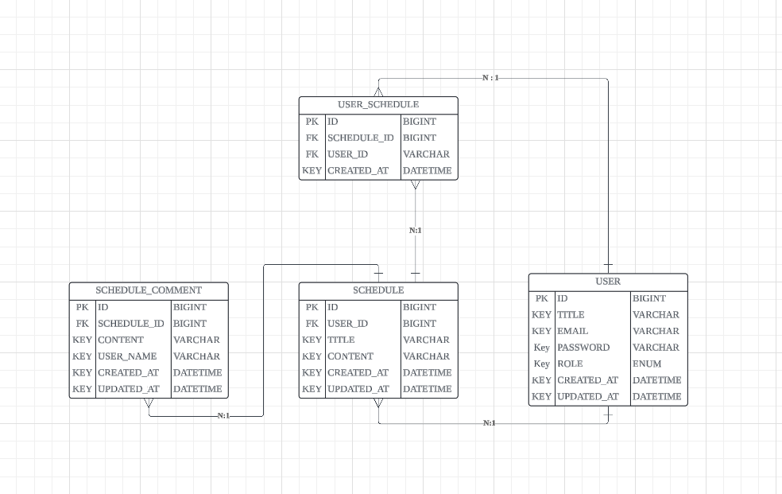

## ERD



## API 명세서

### Schedule API

| **기능**              | **메서드** | **엔드포인트**                | **요청 파라미터/바디**   | **응답**                 | **응답 코드** |
|-----------------------|------------|--------------------------|--------------------------|--------------------------|--------------|
| **스케줄 생성**       | `POST`     | `/api/schedules`          | 요청 바디: 스케줄 정보   | 생성된 스케줄 정보        | `200: 정상등록` |
| **스케줄 목록 조회**  | `GET`      | `/api/schedules`          | 요청 파라미터: 페이지, 정렬 | 스케줄 리스트 (페이지네이션) | `200: 정상조회` |
| **스케줄 단건 조회**  | `GET`      | `/api/schedules/{id}`     | 요청 파라미터: 스케줄 ID  | 단건 스케줄 정보          | `200: 정상조회` |
| **스케줄 수정**       | `PUT`      | `/api/schedules/{id}`     | 요청 바디: 수정 정보      | 수정된 스케줄 정보        | `200: 정상수정` |
| **스케줄 삭제**       | `DELETE`   | `/api/schedules/{id}`     | 요청 파라미터: 스케줄 ID  | 삭제 결과 메시지          | `200: 정상삭제` |

#### 1. 스케줄 생성 API

- **URL**: `/api/schedules`
- **Method**: `POST`
- **Request Body**:
    ```json
    {
      "title": "string",
      "content": "string"
    }
    ```
- **Response**:
    ```json
    {
      "id": "Long",
      "title": "string",
      "content": "string",
      "user_id": "Long",
      "weather" : "string",
      "created_at": "yyyy-MM-dd'T'HH:mm:ss.SSSXXX",
      "updated_at": "yyyy-MM-dd'T'HH:mm:ss.SSSXXX"
    }
    ```

#### 2. 스케줄 목록 조회 API (페이지네이션)

- **URL**: `/api/schedules`
- **Method**: `GET`
- **Request Params**:
    - `page`: `int` - 조회할 페이지 번호
    - `size`: `int` - 페이지 당 항목 수 (optional, 기본값: 10)
    - `sortBy`: `string` - 정렬 기준 필드명
    - `isAsc`: `boolean` - 오름차순 여부
- **Response**:
    ```json
    {
      "content": [
        {
          "id": "Long",
          "title": "string",
          "content": "string",
          "userId": "Long",
          "weather" : "string",
          "createdAt": "yyyy-MM-dd'T'HH:mm:ss.SSSXXX",
          "updatedAt": "yyyy-MM-dd'T'HH:mm:ss.SSSXXX"
        }
      ],
      "pageable": {
        "page": "int",
        "size": "int",
        "totalPages": "int",
        "totalElements": "int"
      }
    }
    ```

#### 3. 스케줄 단건 조회 API

- **URL**: `/api/schedules/{id}`
- **Method**: `GET`
- **Path Variable**:
    - `id`: `Long` - 스케줄 ID
- **Response**:
    ```json
    {
      "id": "Long",
      "title": "string",
      "content": "string",
      "userId": "Long",
      "weather" : "string",
      "createdAt": "yyyy-MM-dd'T'HH:mm:ss.SSSXXX",
      "updatedAt": "yyyy-MM-dd'T'HH:mm:ss.SSSXXX"
    }
    ```

#### 4. 스케줄 수정 API

- **URL**: `/api/schedules/{id}`
- **Method**: `PUT`
- **Path Variable**:
    - `id`: `Long` - 스케줄 ID
- **Request Body**:
    ```json
    {
      "title": "string",
      "content": "string"
    }
    ```
- **Response**:
    ```json
    {
      "id": "Long",
      "title": "string",
      "content": "string",
      "userId": "Long",
      "weather" : "string",
      "createdAt": "yyyy-MM-dd'T'HH:mm:ss.SSSXXX",
      "updatedAt": "yyyy-MM-dd'T'HH:mm:ss.SSSXXX"
    }
    ```

### 스케줄 삭제 API

- **URL**: `/api/schedules/{id}`
- **Method**: `DELETE`
- **Headers**:
    - `Authorization`: `Bearer {token}` - 사용자 인증 토큰 (JWT)
- **Path Variables**:
    - `id`: `Long` - 삭제할 스케줄의 ID
- **Authorization**:
    - `role`이 `ADMIN`이거나, 해당 스케줄의 소유자일 경우에만 삭제 가능.
    - 권한이 없는 사용자가 요청할 경우, `403 Forbidden` 응답.
- **Responses**:
    - `200 OK`: 스케줄 삭제 성공 시, `"Schedule deleted successfully."` 메시지 반환.
    - `403 Forbidden`: 권한이 없는 경우, `"You do not have permission to delete this schedule."` 메시지 반환.
    - `404 Not Found`: 스케줄이 존재하지 않는 경우, `"Schedule not found."` 메시지 반환.

### Schedule Comment API

| **기능**       | **메서드**  | **엔드포인트**                     | **요청 파라미터/바디** | **응답**    | **응답 코드**   |
|--------------|----------|-------------------------------|----------------|-----------|-------------|
| **댓글 생성**    | `POST`   | `/api/schedule/comments`      | 요청 바디: 댓글 정보   | 생성된 댓글 정보 | `200: 정상등록` |
| **댓글 목록      |          |                               |                |           |             |
| 조회**         | `GET`    | `/api/schedule/comments`      | -              | 댓글 리스트    | `200: 정상조회` |
| **댓글 단건 조회** | `GET`    | `/api/schedule/comments/{id}` | 요청 파라미터: 댓글 ID | 단건 댓글 정보  | `200: 정상조회` |
| **댓글 수정**    | `PUT`    | `/api/schedule/comments/{id}` | 요청 바디: 수정 정보   | 수정된 댓글 정보 | `200: 정상수정` |
| **댓글 삭제**    | `DELETE` | `/api/schedule/comments/{id}` | 요청 파라미터: 댓글 ID | 삭제 결과 메시지 | `200: 정상삭제` |

#### 1. 댓글 생성 API

- **URL**: `/api/schedule/comments`
- **Method**: `POST`
- **Request Body**:
    ```json
    {
      "scheduleId": "Long",
      "content": "string",
      "username": "string"
    }
    ```
- **Response**:
    ```json
    {
      "id": "Long",
      "scheduleId": "Long",
      "content": "string",
      "username": "string",
      "createdAt": "yyyy-MM-dd'T'HH:mm:ss.SSSXXX",
      "updatedAt": "yyyy-MM-dd'T'HH:mm:ss.SSSXXX"
    }
    ```

#### 2. 댓글 목록 조회 API

- **URL**: `/api/schedule/comments`
- **Method**: `GET`
- **Response**:
    ```json
    [
      {
        "id": "Long",
        "scheduleId": "Long",
        "content": "string",
        "username": "string",
        "createdAt": "yyyy-MM-dd'T'HH:mm:ss.SSSXXX",
        "updatedAt": "yyyy-MM-dd'T'HH:mm:ss.SSSXXX"
      }
    ]
    ```

#### 3. 댓글 단건 조회 API

- **URL**: `/api/schedule/comments/{id}`
- **Method**: `GET`
- **Path Variable**:
    - `id`: `Long` - 댓글 ID
- **Response**:
    ```json
    {
      "id": "Long",
      "scheduleId": "Long",
      "content": "string",
      "username": "string",
      "createdAt": "yyyy-MM-dd'T'HH:mm:ss.SSSXXX",
      "updatedAt": "yyyy-MM-dd'T'HH:mm:ss.SSSXXX"
    }
    ```

#### 4. 댓글 수정 API

- **URL**: `/api/schedule/comments/{id}`
- **Method**: `PUT`
- **Path Variable**:
    - `id`: `Long` - 댓글 ID
- **Request Body**:
    ```json
    {
      "content": "string"
    }
    ```
- **Response**:
    ```json
    {
      "id": "Long",
      "scheduleId": "Long",
      "content": "string",
      "username": "string",
      "createdAt": "yyyy-MM-dd'T'HH:mm:ss.SSSXXX",
      "updatedAt": "yyyy-MM-dd'T'HH:mm:ss.SSSXXX"
    }
    ```

#### 5. 댓글 삭제 API

- **URL**: `/api/schedule/comments/{id}`
- **Method**: `DELETE`
- **Path Variable**:
    - `id`: `Long` - 댓글 ID
- **Response**:
    - `String`: 삭제 결과 메시지

### User API

| **기능**       | **메서드**  | **엔드포인트**         | **요청 파라미터/바디** | **응답**    | **응답 코드**   |
|--------------|----------|-------------------|----------------|-----------|-------------|
| **유저 생성**    | `POST`   | `/api/users`      | 요청 바디: 유저 정보   | 생성된 유저 정보 | `200: 정상등록` |
| **유저 목록      |          |                   |                |           |             |
| 조회**         | `GET`    | `/api/users`      | -              | 유저 리스트    | `200: 정상조회` |
| **유저 단건 조회** | `GET`    | `/api/users/{id}` | 요청 파라미터: 유저 ID | 단건 유저 정보  | `200: 정상조회` |
| **유저 수정**    | `PUT`    | `/api/users/{id}` | 요청 바디: 수정 정보   | 수정된 유저 정보 | `200: 정상수정` |
| **유저 삭제**    | `DELETE` | `/api/users/{id}` | 요청 파라미터: 유저 ID | 삭제 결과 메시지 | `200: 정상삭제` |

#### 1. 유저 생성 API

- **URL**: `/api/users`
- **Method**: `POST`
- **Request Body**:
    ```json
    {
      "username": "string",
      "email": "string",
      "password" : "string",
      "role" : "string"
    }
    ```
- **Response**:
    ```json
    {
      "id": "Long",
      "username": "string",
      "email": "string",
      "role" : "string",
      "createdAt": "yyyy-MM-dd'T'HH:mm:ss.SSSXXX",
      "updatedAt": "yyyy-MM-dd'T'HH:mm:ss.SSSXXX"
    }
    ```

#### 2. 유저 목록 조회 API

- **URL**: `/api/users`
- **Method**: `GET`
- **Response**:
    ```json
    [
      {
        "id": "Long",
        "username": "string",
        "email": "string",
        "role" : "string",
        "createdAt": "yyyy-MM-dd'T'HH:mm:ss.SSSXXX",
        "updatedAt": "yyyy-MM-dd'T'HH:mm:ss.SSSXXX"
      }
    ]
    ```

#### 3. 유저 단건 조회 API

- **URL**: `/api/users/{id}`
- **Method**: `GET`
- **Path Variable**:
    - `id`: `Long` - 유저 ID
- **Response**:
    ```json
    {
      "id": "Long",
      "username": "string",
      "email": "string",
      "role" : "string",
      "createdAt": "yyyy-MM-dd'T'HH:mm:ss.SSSXXX",
      "updatedAt": "yyyy-MM-dd'T'HH:mm:ss.SSSXXX"
    }
    ```

#### 4. 유저 수정 API

- **URL**: `/api/users/{id}`
- **Method**: `PUT`
- **Path Variable**:
    - `id`: `Long` - 유저 ID
- **Request Body**:
    ```json
    {
      "username": "string",
      "email": "string"
    }
    ```
- **Response**:
    ```json
    {
      "id": "Long",
      "username": "string",
      "email": "string",
      "createdAt": "yyyy-MM-dd'T'HH:mm:ss.SSSXXX",
      "updatedAt": "yyyy-MM-dd'T'HH:mm:ss.SSSXXX"
    }
    ```

#### 5. 유저 삭제 API

- **URL**: `/api/users/{id}`
- **Method**: `DELETE`
- **Path Variable**:
    - `id`: `Long` - 유저 ID
- **Response**:
    - `String`: 삭제 결과 메시지

